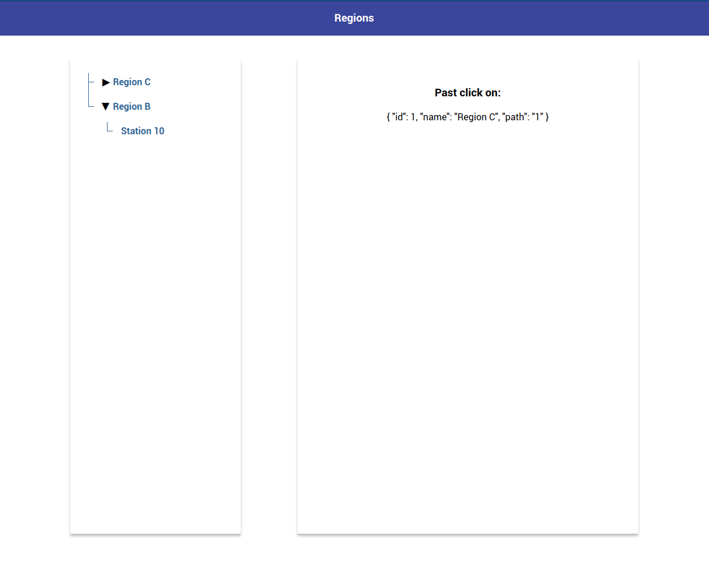

# Setup:
* Run init.sql code in your db
* Change db config in ./api/.env
* Change api url in ./client/src/api/api.config.ts (if needed)

# To run a project:
* ~/ cd api/regions
  * npm install
  * npm start
* ~/ cd client
  * npm install
  * npm start
  
# Preview:
